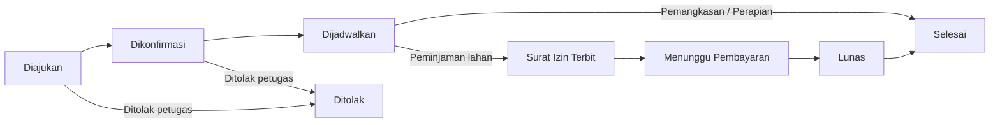
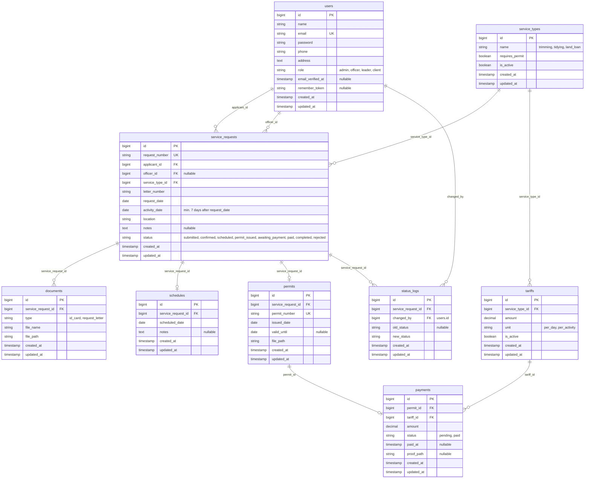

# PRD — Sistem Informasi Layanan Dinas Lingkungan Hidup

**SILAT RTH (Sistem Layanan Cepat Ruang Terbuka Hijau)**

> 💡 **Tips:** PRD (Product Requirements Document) itu cuma "surat permintaan" ke AI coding assistant (misalnya Claude). Isi dengan bahasa sehari-hari, tidak perlu istilah teknis. Semakin jelas dan konkret isiannya, semakin bagus hasil sistem yang dibuatkan AI.

| | |
| --- | --- |
| **Nama Sistem** | Sistem Informasi Layanan Dinas Lingkungan Hidup (SILAT RTH) |
| **Tanggal** | 23 September 2026 |
| **Disusun oleh** | Ghaliyah Ayu Guswami — Pengendali Dampak Lingkungan Ahli Pertama |
| **Instansi** | Dinas Lingkungan Hidup Kabupaten Trenggalek |

---

## 1. Ringkasan Singkat

Dinas Lingkungan Hidup butuh sistem online untuk layanan pengelolaan Ruang Terbuka Hijau (RTH) dan sewa/peminjaman fasilitas RTH. Klien (masyarakat atau instansi lain) bisa mendaftar dan mengajukan permohonan secara online, staf tidak perlu lagi mencatat manual, dan pimpinan bisa melihat laporan kapan saja.

**Target:** mempersingkat waktu layanan pendaftaran.

---

## 2. Siapa Saja yang Akan Memakai Sistem

| Peran | Contoh Orangnya | Bisa Ngapain Saja |
| --- | --- | --- |
| **Admin** | Staf Bidang Tata Lingkungan, Pengelolaan Keanekaragaman Hayati dan Peningkatan Kapasitas | Atur semua data & akses pengguna lain |
| **Petugas Layanan** | Staf Bidang Tata Lingkungan, Pengelolaan Keanekaragaman Hayati dan Peningkatan Kapasitas | Input pendaftaran, konfirmasi, penjadwalan, terbitkan surat izin, cetak bukti/invoice pembayaran |
| **Pimpinan** | Kepala Dinas Lingkungan Hidup Kabupaten Trenggalek | Lihat dashboard & laporan (tidak bisa ubah data) |
| **Klien** | Masyarakat / instansi lain | Daftar layanan, upload dokumen, cek status |

---

## 3. Layanan yang Ingin Dibuat Sistemnya

### Layanan A — SILAT RTH (Sistem Layanan Cepat Ruang Terbuka Hijau)

Layanan ini mencakup tiga jenis permohonan:

1. Pemangkasan
2. Perapian
3. Peminjaman lahan

**a) Apa langkah-langkahnya, dari klien datang sampai selesai?**

1. Klien mengajukan permohonan pelayanan (pemangkasan / perapian / peminjaman lahan).
2. Klien mengisi formulir dan mengunggah surat permohonan.
3. Petugas mengecek usulan permohonan dan mengonfirmasi kepada pemohon.
4. Petugas menjadwalkan pelayanan yang telah diajukan.
5. Khusus peminjaman lahan: diterbitkan surat izin.
6. Pemohon membayar tarif sesuai yang tertera di surat izin.

**b) Data apa saja yang perlu disimpan sistem?**

- Nama
- Tanggal kegiatan
- Nomor telepon
- Alamat
- Foto KTP
- Nomor surat pengajuan dari pemohon

**c) Ada aturan khusus yang harus dipatuhi sistem?**

- Pengajuan layanan dilakukan **H-7 sebelum kegiatan** (sistem menolak pengajuan yang tanggal kegiatannya kurang dari 7 hari dari tanggal pengajuan).

---

## 4. Laporan & Dashboard yang Dibutuhkan

| Ingin lihat apa? | Contoh |
| --- | --- |
| **Info di dashboard utama** | Jumlah pemohon, jumlah pemohon yang telah ditindaklanjuti |
| **Laporan rutin** | Rekap bulanan (Excel/PDF), statistik pemohon per bulan |

---

## 5. Catatan untuk AI Coding Assistant

*Bagian ini boleh dibiarkan seperti apa adanya. Ini "instruksi teknis" otomatis untuk AI.*

- Tiap Layanan di Bagian 3 → jadi satu modul/menu di sistem
- Tiap langkah alur → jadi status transaksi (contoh: Menunggu → Dikonfirmasi → Lunas → Selesai)
- Tiap data yang dicatat → jadi kolom di database
- Tiap aturan bisnis → jadi validasi otomatis di sistem
- Bagian 4 → jadi tampilan dashboard + tombol ekspor PDF/Excel

### 5.1 Alur status permohonan (turunan dari Bagian 3a)

### 5.2 Validasi otomatis

- Tanggal kegiatan minimal 7 hari setelah tanggal pengajuan (H-7).
- Formulir tidak bisa dikirim jika foto KTP atau surat permohonan belum diunggah.
- Surat izin dan pembayaran hanya muncul untuk jenis layanan **Peminjaman lahan**.
- Peran **Pimpinan** hanya bisa membaca (tanpa tombol ubah/hapus).

### 5.3 ER Diagram (standar Laravel)

Konvensi yang dipakai: nama tabel **jamak, snake_case, bahasa Inggris**; nama kolom snake_case bahasa Inggris; primary key `id`; foreign key berformat `<nama_tabel_tunggal>_id`; kolom `created_at` dan `updated_at` di setiap tabel (dibuat otomatis lewat `$table->timestamps()`).

**Padanan istilah Indonesia → tabel/kolom database**

| Istilah di PRD | Tabel / Kolom |
| --- | --- |
| Pengguna / peran | `users` / `users.role` |
| Jenis layanan (pemangkasan, perapian, peminjaman lahan) | `service_types` |
| Permohonan | `service_requests` |
| Nama, nomor telepon, alamat | `users.name`, `users.phone`, `users.address` |
| Tanggal kegiatan | `service_requests.activity_date` |
| Nomor surat pengajuan | `service_requests.letter_number` |
| Foto KTP, surat permohonan | `documents` (`type` = `id_card` / `request_letter`) |
| Penjadwalan | `schedules` |
| Surat izin | `permits` |
| Tarif dan pembayaran | `tariffs`, `payments` |
| Riwayat status | `status_logs` |

### 5.4 Kebutuhan dashboard & ekspor

- **Dashboard:** jumlah pemohon (total), jumlah pemohon yang sudah ditindaklanjuti (`status` selain `submitted`).
- **Laporan bulanan:** rekap permohonan per bulan dan statistik pemohon per bulan, dengan tombol **Ekspor PDF** dan **Ekspor Excel**.
- Data sumber laporan: tabel `service_requests` (dikelompokkan per `request_date` dan `service_type_id`) dan `payments`.

---

## Catatan Asumsi (mohon dicek dan diedit)

Hal-hal berikut saya tambahkan agar draf lengkap, tetapi belum tertulis di template Anda:

1. **Alur pemangkasan/perapian** diasumsikan tanpa surat izin dan tanpa pembayaran. Jika keduanya juga berbayar, ubah aturan di 5.2.
2. **Status "Ditolak"** ditambahkan sebagai jalur alternatif saat petugas mengecek permohonan.
3. **Tarif** (`tariffs`) disimpan di tabel terpisah agar mudah diubah tanpa mengubah kode. Besaran dan satuan tarif belum diisi.
4. **Riwayat status** (`status_logs`) ditambahkan untuk melacak siapa mengubah status dan kapan (berguna untuk laporan "ditindaklanjuti").
5. Pembayaran diasumsikan dicatat petugas setelah klien membayar, bukan lewat payment gateway online.
