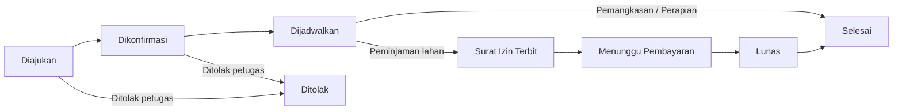
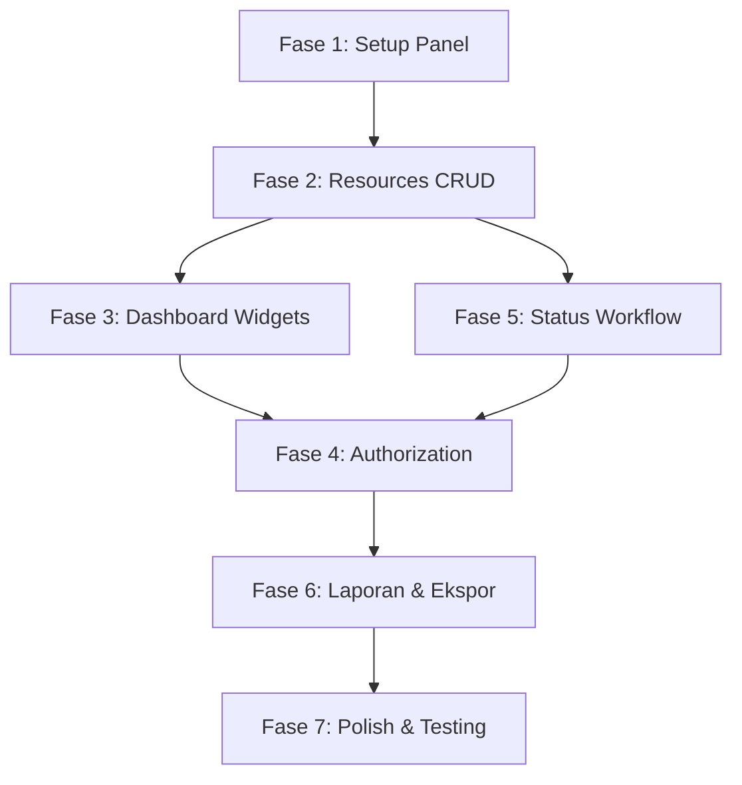

# 🎯 Rencana Aksi — Dashboard SILAT RTH (Filament v5)

> Rencana pembuatan dashboard admin untuk Sistem Layanan Cepat Ruang Terbuka Hijau  
> **Stack:** Laravel 13 · Filament 5.8 · PHP 8.4 · SQLite

---

## 📊 Status Proyek Saat Ini

| Komponen | Status |
|---|---|
| Model (9 model) | ✅ Sudah ada |
| Enum (5 enum) | ✅ Sudah ada |
| Migration (12 file) | ✅ Sudah ada |
| Factory (9 factory) | ✅ Sudah ada |
| Seeder (4 seeder) | ✅ Sudah ada |
| AdminPanelProvider | ✅ Sudah ada (default panel) |
| Filament Resources | ❌ Belum ada |
| Filament Widgets | ❌ Belum ada |
| Filament Pages | ❌ Belum ada |
| Policy / Authorization | ❌ Belum ada |

---

## 🗂️ Fase & Urutan Pengerjaan

### Fase 1 — Setup Panel & Konfigurasi Dasar
> **Estimasi: ~30 menit**

| # | Tugas | Detail |
|---|---|---|
| 1.1 | **Konfigurasi AdminPanelProvider** | Update [AdminPanelProvider.php](file:///c:/laragon/www/app-layanan/app/Providers/Filament/AdminPanelProvider.php): set branding (nama "SILAT RTH"), navigation grouping, warna tema hijau (sesuai identitas lingkungan hidup), favicon |
| 1.2 | **Setup Navigation Groups** | Buat 4 group: "Dashboard", "Layanan", "Master Data", "Manajemen" |
| 1.3 | **Jalankan `php artisan db:seed`** | Pastikan data dummy tersedia untuk development |
| 1.4 | **Verifikasi login** | Pastikan user seeder dapat login ke panel `/admin` |

---

### Fase 2 — Filament Resources (CRUD)
> **Estimasi: ~2-3 jam**

Setiap resource dibuat dengan `php artisan make:filament-resource`.

#### 2.1 — ServiceRequestResource ⭐ (Resource Utama)
| Komponen | Detail |
|---|---|
| **Table columns** | `request_number`, `applicant.name`, `serviceType.name`, `activity_date`, `status` (badge dengan warna dari enum), `created_at` |
| **Filters** | Status (SelectFilter dari `ServiceRequestStatus`), Jenis layanan (SelectFilter), Rentang tanggal (DateFilter) |
| **Form** | Semua field sesuai kolom `service_requests`, relasi dropdown ke `users` & `service_types`, date picker dengan validasi H-7 |
| **Actions** | Konfirmasi, Jadwalkan, Terbitkan Surat Izin, Tolak (masing-masing mengubah status + insert `status_logs`) |
| **Relations** | `DocumentsRelationManager`, `ScheduleRelationManager`, `PermitRelationManager`, `StatusLogsRelationManager` |
| **Halaman** | List, Create, Edit, View (View khusus untuk role Pimpinan) |

#### 2.2 — UserResource
| Komponen | Detail |
|---|---|
| **Table columns** | `name`, `email`, `phone`, `role` (badge), `created_at` |
| **Filters** | Role (SelectFilter dari `UserRole`) |
| **Form** | name, email, password (hashed), phone, address, role (select) |
| **Akses** | Hanya Admin yang bisa kelola user |

#### 2.3 — ServiceTypeResource
| Komponen | Detail |
|---|---|
| **Table columns** | `name`, `requires_permit` (icon boolean), `is_active` (toggle) |
| **Form** | name, requires_permit (toggle), is_active (toggle) |
| **Akses** | Hanya Admin |

#### 2.4 — TariffResource
| Komponen | Detail |
|---|---|
| **Table columns** | `serviceType.name`, `amount` (format Rupiah), `unit`, `is_active` |
| **Form** | service_type_id (select), amount, unit (select dari `TariffUnit`), is_active |
| **Akses** | Hanya Admin |

#### 2.5 — PaymentResource
| Komponen | Detail |
|---|---|
| **Table columns** | `permit.permit_number`, `tariff.amount`, `amount`, `status` (badge), `paid_at` |
| **Form** | Minimal — diisi otomatis dari alur izin, petugas hanya konfirmasi pembayaran & upload bukti |
| **Actions** | "Konfirmasi Lunas" action |

#### 2.6 — PermitResource
| Komponen | Detail |
|---|---|
| **Table columns** | `permit_number`, `serviceRequest.request_number`, `issued_date`, `valid_until` |
| **Form** | permit_number (auto-generate), issued_date, valid_until, file upload surat izin |
| **Akses** | Petugas & Admin |

---

### Fase 3 — Dashboard Widgets
> **Estimasi: ~1-2 jam**

Sesuai kebutuhan PRD Bagian 4.

#### 3.1 — StatsOverviewWidget
Widget stat cards di halaman dashboard utama:

| Stat Card | Query | Icon |
|---|---|---|
| **Total Pemohon** | `ServiceRequest::count()` | `heroicon-o-users` |
| **Sudah Ditindaklanjuti** | `ServiceRequest::where('status', '!=', 'submitted')->count()` | `heroicon-o-check-circle` |
| **Menunggu Konfirmasi** | `ServiceRequest::where('status', 'submitted')->count()` | `heroicon-o-clock` |
| **Selesai Bulan Ini** | `ServiceRequest::where('status', 'completed')->whereMonth('updated_at', now()->month)->count()` | `heroicon-o-trophy` |

#### 3.2 — ServiceRequestChart (Chart Widget)
- **Tipe:** Line / Bar chart
- **Data:** Jumlah permohonan per bulan (12 bulan terakhir)
- **Group by:** `service_type_id` (3 dataset: Pemangkasan, Perapian, Peminjaman Lahan)
- **Sumber:** `service_requests` grouped by `request_date` bulan & `service_type_id`

#### 3.3 — StatusDistributionChart (Chart Widget)
- **Tipe:** Doughnut / Pie chart
- **Data:** Distribusi status permohonan aktif saat ini
- **Warna:** Sesuai `ServiceRequestStatus::color()`

#### 3.4 — LatestRequestsWidget (Table Widget)
- **Tipe:** Table widget
- **Data:** 5 permohonan terbaru dengan status badge
- **Kolom:** request_number, applicant name, service type, status, tanggal

---

### Fase 4 — Authorization & Policy
> **Estimasi: ~1 jam**

#### 4.1 — Buat Policy per Resource

| Policy | Aturan |
|---|---|
| `ServiceRequestPolicy` | Admin & Officer: full CRUD; Leader: view only; Client: tidak akses panel |
| `UserPolicy` | Hanya Admin |
| `ServiceTypePolicy` | Hanya Admin |
| `TariffPolicy` | Hanya Admin |
| `PaymentPolicy` | Admin & Officer |
| `PermitPolicy` | Admin & Officer |

#### 4.2 — Konfigurasi Gate di Panel
- Tambahkan `->gate()` atau custom middleware di `AdminPanelProvider` agar role `client` tidak bisa akses panel admin
- Pimpinan (`leader`) hanya bisa **view** — semua tombol create/edit/delete disembunyikan

---

### Fase 5 — Alur Bisnis (Status Workflow)
> **Estimasi: ~1-2 jam**

#### 5.1 — Custom Actions pada ServiceRequestResource



| Action | Dari Status | Ke Status | Logika Tambahan |
|---|---|---|---|
| **Konfirmasi** | `submitted` | `confirmed` | Assign `officer_id`, insert `status_logs` |
| **Jadwalkan** | `confirmed` | `scheduled` | Buat record `schedules`, input tanggal jadwal |
| **Terbitkan Izin** | `scheduled` | `permit_issued` | Hanya jika `service_type.requires_permit == true`, buat record `permits` |
| **Selesaikan** | `scheduled` / `paid` | `completed` | Untuk non-izin: langsung dari `scheduled`; untuk izin: dari `paid` |
| **Tandai Lunas** | `awaiting_payment` | `paid` | Update `payments.status = paid`, catat `paid_at` |
| **Tolak** | `submitted` / `confirmed` | `rejected` | Wajib isi alasan (notes) |

#### 5.2 — Validasi Otomatis
- `activity_date` minimal 7 hari setelah `request_date` (validasi di Form)
- Formulir wajib upload KTP & surat permohonan (validasi required di `DocumentsRelationManager`)
- Surat izin & pembayaran hanya muncul jika `service_type.requires_permit == true`

---

### Fase 6 — Laporan & Ekspor
> **Estimasi: ~1 jam**

#### 6.1 — Halaman Laporan Bulanan
- Buat custom Filament Page: `app/Filament/Pages/MonthlyReport.php`
- Filter: bulan & tahun (dropdown)
- Tabel: rekap per jenis layanan & status
- Statistik ringkasan

#### 6.2 — Tombol Ekspor
| Format | Implementasi |
|---|---|
| **Ekspor Excel** | Gunakan `BulkAction::make('export')` atau Filament built-in export action di Table |
| **Ekspor PDF** | Gunakan package `barryvdh/laravel-dompdf` atau Filament Table export |

---

### Fase 7 — Polish & Testing
> **Estimasi: ~1-2 jam**

| # | Tugas |
|---|---|
| 7.1 | Buat Feature Test untuk setiap Resource (CRUD operations) |
| 7.2 | Buat Feature Test untuk alur status workflow |
| 7.3 | Buat Feature Test untuk authorization/policy |
| 7.4 | Jalankan `vendor/bin/pint --dirty --format agent` |
| 7.5 | Tes manual: login sebagai Admin, Officer, Leader — verifikasi akses |
| 7.6 | Verifikasi dashboard widgets menampilkan data yang benar |

---

## 📁 Struktur File yang Akan Dibuat

```
app/
├── Filament/
│   ├── Pages/
│   │   └── MonthlyReport.php
│   ├── Resources/
│   │   ├── ServiceRequestResource.php
│   │   ├── ServiceRequestResource/
│   │   │   ├── Pages/
│   │   │   │   ├── ListServiceRequests.php
│   │   │   │   ├── CreateServiceRequest.php
│   │   │   │   ├── EditServiceRequest.php
│   │   │   │   └── ViewServiceRequest.php
│   │   │   └── RelationManagers/
│   │   │       ├── DocumentsRelationManager.php
│   │   │       ├── ScheduleRelationManager.php
│   │   │       ├── PermitRelationManager.php
│   │   │       └── StatusLogsRelationManager.php
│   │   ├── UserResource.php
│   │   ├── UserResource/Pages/...
│   │   ├── ServiceTypeResource.php
│   │   ├── ServiceTypeResource/Pages/...
│   │   ├── TariffResource.php
│   │   ├── TariffResource/Pages/...
│   │   ├── PaymentResource.php
│   │   ├── PaymentResource/Pages/...
│   │   ├── PermitResource.php
│   │   └── PermitResource/Pages/...
│   └── Widgets/
│       ├── StatsOverviewWidget.php
│       ├── ServiceRequestChart.php
│       ├── StatusDistributionChart.php
│       └── LatestRequestsWidget.php
├── Policies/
│   ├── ServiceRequestPolicy.php
│   ├── UserPolicy.php
│   ├── ServiceTypePolicy.php
│   ├── TariffPolicy.php
│   ├── PaymentPolicy.php
│   └── PermitPolicy.php
tests/
└── Feature/
    ├── ServiceRequestResourceTest.php
    ├── UserResourceTest.php
    ├── ServiceRequestWorkflowTest.php
    └── AuthorizationTest.php
```

---

## ⚡ Urutan Eksekusi yang Disarankan



> [!IMPORTANT]
> **Fase 2 dan Fase 5 bisa dikerjakan paralel**, karena workflow action tinggal ditambahkan ke resource yang sudah ada. Fase 4 (authorization) sebaiknya dikerjakan setelah resource dan widget selesai, agar tidak menghambat development.

---

## 📝 Catatan Teknis

- **Filament v5.8** sudah terinstall — tidak perlu install ulang
- **Navigation:** Gunakan `->navigationGroup()` di setiap resource untuk grouping menu
- **Branding:** Ganti warna dari `Color::Amber` ke `Color::Green` (identitas Dinas LH)
- **Locale:** Label enum sudah dalam Bahasa Indonesia (`->label()`)
- **Auto-discover:** Panel sudah dikonfigurasi `discoverResources()` dan `discoverWidgets()` — file baru di `app/Filament/` akan otomatis terdaftar
